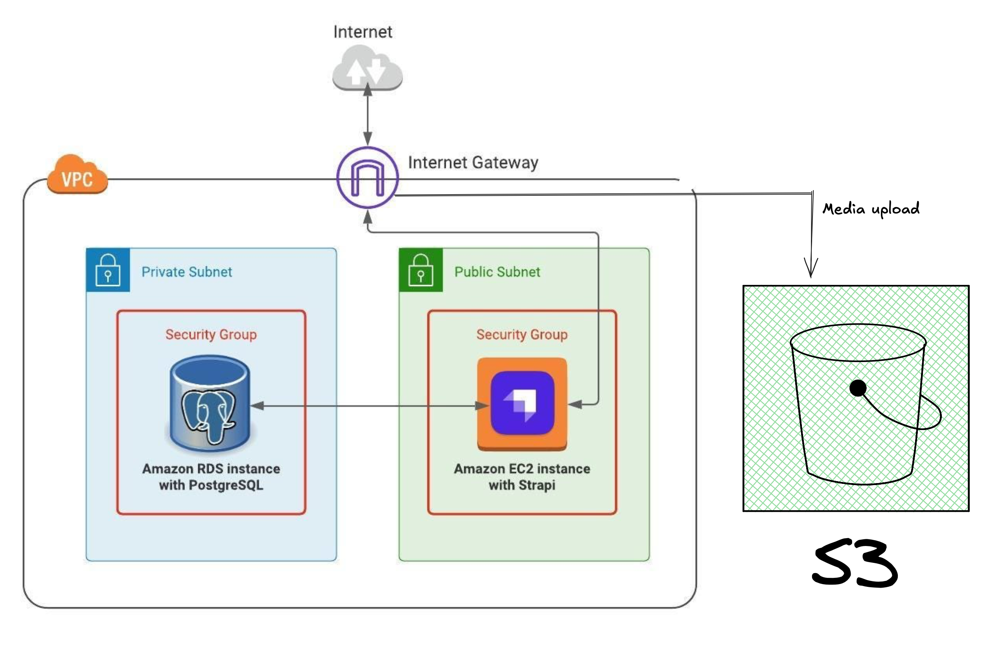

# Strapi CMS Automated Deployment on AWS



## 📋 Overview

This project automates the deployment of a production-ready **Strapi CMS** on AWS using Terraform. The infrastructure includes an EC2 instance for the application, RDS MySQL for the database, and S3 for media storage, all deployed in a custom VPC with proper security configurations.

## 🏗️ Architecture

The infrastructure consists of:

- **VPC**: Custom VPC with public and private subnets across multiple availability zones
- **EC2 Instance**: c5.large instance running Strapi CMS with automated deployment via cloud-init
- **RDS MySQL**: db.t3.micro instance for database storage in private subnets
- **S3 Bucket**: For media file storage with public read access
- **IAM Roles**: EC2 instance profile with S3 access permissions
- **Security Groups**: 
  - EC2 SG: Allows HTTP (80), Strapi (1337), and SSH (22)
  - RDS SG: Allows MySQL (3306) access only from EC2 instance
- **Internet Gateway**: For public internet access
- **Route Tables**: Configured for public subnet routing

## 📁 Project Structure

```
├── backend.tf                 # Terraform backend configuration
├── Cloud-init-strapi.sh       # EC2 user data script for automated Strapi setup
├── ec2_instance.tf            # EC2 instance configuration
├── ec2_security_group.tf      # Security group for EC2
├── iam.tf                     # IAM roles and policies
├── main.tf                    # Main Terraform configuration
├── outputs.tf                 # Output values
├── provider.tf                # AWS provider configuration
├── rds.tf                     # RDS database configuration
├── rds_security_group.tf      # Security group for RDS
├── s3.tf                      # S3 bucket configuration
├── terraform.tfvars           # Variable values (not committed to Git)
├── variables.tf               # Variable declarations
├── vpc.tf                     # VPC, subnets, and networking
└── StrapiCMSDeploy.png        # Architecture diagram
```

## 🚀 Features

- ✅ **Fully Automated Deployment**: Single command deployment with Terraform
- ✅ **Cloud-Init Integration**: Strapi CMS automatically installed and configured on EC2
- ✅ **Database Configuration**: MySQL database connection pre-configured
- ✅ **S3 Media Storage**: Integrated AWS S3 for scalable media file storage
- ✅ **Security Best Practices**: 
  - RDS in private subnets
  - Security groups with least privilege access
  - IAM roles instead of hardcoded credentials
- ✅ **Production Ready**: PM2 process manager for application management
- ✅ **Auto-Generated Secrets**: Secure app keys and JWT secrets generated automatically

## 📋 Prerequisites

- **Terraform**: v1.0 or later
- **AWS Account**: With appropriate permissions
- **AWS CLI**: Configured with credentials
- **SSH Key Pair**: Existing key pair in AWS (or update `variables.tf`)
- **S3 Bucket**: Pre-existing bucket (or modify `s3.tf` to create one)

## 🔧 Configuration

### 1. Clone the Repository

```bash
git clone https://github.com/yourusername/StrapiCMSDeploy.git
cd StrapiCMSDeploy
```

### 2. Create `terraform.tfvars`

Create a `terraform.tfvars` file with your specific values:

```hcl
# AWS Region
region = "ap-south-1"

# EC2 Configuration
ec2_config = {
  ami_id                      = "ami-02b8269d5e85954ef"  # Ubuntu 24.04 LTS in ap-south-1
  instance_type               = "c5.large"
  associate_public_ip_address = "true"
}

# RDS Configuration
rds_db_config = {
  allocated_storage       = "20"
  db_name                 = "strapi_db"
  db_username             = "admin"
  db_password             = "YourSecurePassword123!"  # Change this!
  db_instance_class       = "db.t3.micro"
  engine                  = "mysql"
  engine_version          = "8.0.42"
  skip_final_snapshot     = "true"
  backup_retention_period = "7"
  storage_encrypted       = "false"
  delete_automated_backups = "true"
}

# S3 Bucket Name
s3 = "your-bucket-name"

# SSH Key Configuration
private_key_config = {
  key_name         = "your-key-name"
  private_key_path = "/path/to/your-key.pem"
}

# AWS Credentials for S3 Upload (can be removed if using IAM roles only)
aws_access_key_id     = "your-access-key"
aws_secret_access_key = "your-secret-key"
```

### 3. Update Variables

Modify the following files if needed:

- **`variables.tf`**: Update default values
- **`iam.tf`**: Update S3 bucket ARN (line 30-31)
- **`Cloud-init-strapi.sh`**: Customize Strapi installation if needed

## 🚀 Deployment

### Initialize Terraform

```bash
terraform init
```

### Plan the Deployment

```bash
terraform plan
```

### Apply the Configuration

```bash
terraform apply
```

Type `yes` when prompted to confirm.

### Deployment Time

⏱️ **Estimated deployment time**: 15-20 minutes
- Terraform provisioning: 5-7 minutes
- Strapi installation: 10-15 minutes

## 📊 Outputs

After successful deployment, Terraform will output:

```
ec2_public_ip       = "13.127.32.123"
ec2_public_dns      = "ec2-13-127-32-123.ap-south-1.compute.amazonaws.com"
strapi_url          = "http://13.127.32.123:1337"
rds_endpoint        = "terraform-xxx.xxx.ap-south-1.rds.amazonaws.com:3306"
rds_database_name   = "strapi_db"
```

## 🔍 Accessing Strapi

### Admin Panel

Access the Strapi admin panel at:
```
http://<EC2_PUBLIC_IP>:1337/admin
```

Create your admin account on first visit.

### SSH Access

```bash
ssh -i /path/to/your-key.pem ubuntu@<EC2_PUBLIC_IP>
```

### Monitor Deployment

Check cloud-init logs:
```bash
ssh -i /path/to/your-key.pem ubuntu@<EC2_PUBLIC_IP> 'tail -f /var/log/cloud-init-output.log'
```

Check Strapi logs:
```bash
ssh -i /path/to/your-key.pem ubuntu@<EC2_PUBLIC_IP>
pm2 logs strapi
```

## 🧹 Cleanup

To destroy all resources:

```bash
terraform destroy
```

Type `yes` when prompted.

**⚠️ Warning**: This will permanently delete all resources including the database!

## 🔐 Security Considerations

### Production Recommendations

1. **Database Password**: Use AWS Secrets Manager or SSM Parameter Store
2. **SSH Access**: Restrict SSH to your IP address in `ec2_security_group.tf`
3. **HTTPS**: Add an Application Load Balancer with SSL certificate
4. **RDS Encryption**: Enable `storage_encrypted = true` for production
5. **S3 Versioning**: Enable versioning for media backup
6. **Backup Strategy**: Configure automated RDS snapshots
7. **Monitoring**: Add CloudWatch alarms for resource monitoring

### Current Security Features

- ✅ RDS in private subnets (no public access)
- ✅ Security groups with restricted access
- ✅ IAM roles for EC2-to-S3 access
- ✅ Auto-generated application secrets

## 🛠️ Troubleshooting

### Strapi Not Starting

```bash
# Check PM2 status
pm2 status

# View Strapi logs
pm2 logs strapi

# Restart Strapi
pm2 restart strapi
```

### Database Connection Issues

```bash
# Test MySQL connection from EC2
mysql -h <RDS_ENDPOINT> -u admin -p
```

### S3 Upload Issues

```bash
# Check environment variables
cat /home/ubuntu/strapiCMS/.env | grep AWS

# Check IAM instance profile
aws sts get-caller-identity
```

## 📝 Notes

- This configuration is designed for **development/assignment purposes**
- For production, consider using:
  - Multi-AZ RDS deployment
  - Auto Scaling Groups for EC2
  - CloudFront for S3 content delivery
  - AWS Application Load Balancer
  - HTTPS/SSL certificates
  - Secrets management (AWS Secrets Manager)


## 👤 Author

**Aadith Arasu**


